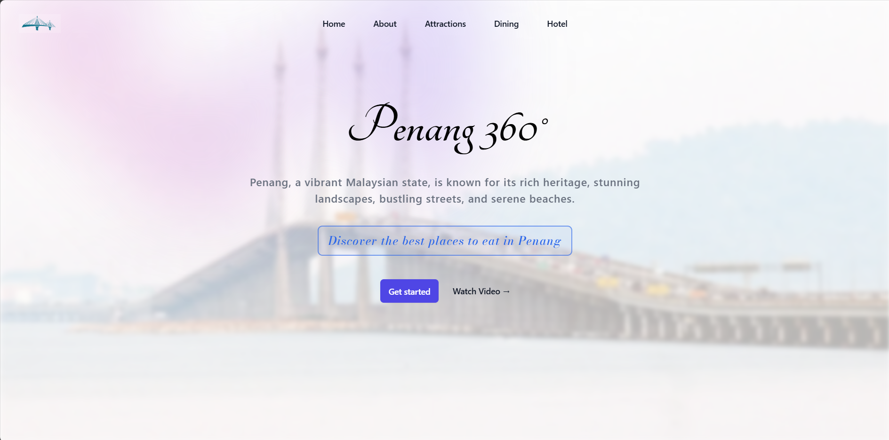

# Penang 360°

**Live site:** [penang-360-usm.vercel.app](https://penang-360-usm.vercel.app/)  
**GitHub repo:** [github.com/WenHao1223/penang-360](https://github.com/WenHao1223/penang-360)

## 🌏 About

**Penang 360°** is a responsive, visually engaging web app designed to provide locals and tourists with the best experiences in Penang. It offers curated information on attractions, dining, and hotels – all in one place.

Built using **React**, **TypeScript**, and **Vite**, this project emphasizes fast performance, intuitive design, and scalable code structure.

## 📸 Screenshot


## 🚀 Features

- 📍 Discover Penang’s top attractions
- 🍜 Find the best local food & dining spots
- 🏨 Explore hotels by location and amenities
- 📱 Mobile-responsive interface
- 🎥 Embedded video overview
- 🖼️ Interactive image cards and hover effects


## 🛠️ Tech Stack

- **Frontend:** React 18, TypeScript
- **Build Tool:** Vite
- **Styling:** Tailwind CSS
- **Linting:** ESLint with type-aware config
- **Deployment:** Vercel

---

## 📦 Development Setup

```bash
npm install
npm run dev
